# GitHub Workflow Execution and Data Flow Diagrams

## 1. Overall Workflow Execution and Data Flow

Shows all GitHub events and how they trigger different workflows with color-coded categories.

```mermaid
graph TD
    subgraph "GitHub Events"
        E1["📌 Push to main<br/>pkg-cmd changes"]
        E2["🔀 PR to pkg-cmd<br/>excluding pkg/istorage"]
        E3["🔀 PR to .github/workflows"]
        E4["⏰ Daily Schedule<br/>5 AM UTC"]
        E5["📋 Issue opened<br/>cprc/cprelease"]
        E6["🔀 PR to pkg/istorage<br/>storage paths"]
        E7["✅ Issue closed"]
        E8["🔄 Issue reopened"]
        E9["▶️ Manual trigger<br/>ctool-integration-test"]
    end

    subgraph "Voedger Workflows"
        W1["ci-pkg-cmd.yml"]
        W2["ci-pkg-cmd_pr.yml"]
        W3["ci-wf_pr.yml"]
        W4["ci-full.yml"]
        W5["cp.yml"]
        W6["ci-pkg-storage.yml"]
        W7["linkIssue.yml"]
        W8["unlinkIssue.yml"]
        W9["ctool-integration-test.yml"]
    end

    subgraph "CI-Action Reusable Workflows"
        CW1["ci_reuse_go.yml"]
        CW2["ci_reuse_go_pr.yml"]
        CW3["cp.yml"]
        CW4["ci_cas.yml"]
        CW5["ci_amazon.yml"]
        CW6["ci-vulncheck.yml"]
        CW7["cd-voedger.yml"]
        CW8["merge.yml"]
        CW9["create_issue.yml"]
    end

    subgraph "Voedger Workflows - Storage Tests"
        ST1["ci_cas.yml"]
        ST2["ci_amazon.yml"]
    end

    subgraph "Data Flow & Outputs"
        D1["✓ Tests Pass"]
        D2["✗ Tests Fail"]
        D3["📊 Coverage Report"]
        D4["🐳 Docker Image"]
        D5["🔗 PR Auto-Merge"]
        D6["📝 Issue Comment"]
        D7["🏷️ Milestone Link"]
    end

    E1 --> W1
    E2 --> W2
    E3 --> W3
    E4 --> W4
    E5 --> W5
    E6 --> W6
    E7 --> W7
    E8 --> W8
    E9 --> W9

    W1 --> CW1
    W1 --> CW7
    W2 --> CW2
    W2 --> CW8
    W3 --> CW8
    W4 --> CW1
    W4 --> CW6
    W4 --> CW7
    W5 --> CW3
    W6 --> ST1
    W6 --> ST2
    W6 --> CW8
    W7 --> D7
    W8 --> D7

    CW1 --> D1
    CW1 --> D2
    CW1 --> D3
    CW2 --> D1
    CW2 --> D2
    CW2 --> D5
    CW6 --> D1
    CW6 --> D2
    CW7 --> D4
    CW8 --> D5
    CW3 --> D6
    ST1 --> D1
    ST1 --> D2
    ST2 --> D1
    ST2 --> D2

    D2 --> CW9

    style E1 fill:#e1f5ff
    style E2 fill:#e1f5ff
    style E3 fill:#e1f5ff
    style E4 fill:#fff3e0
    style E5 fill:#f3e5f5
    style E6 fill:#e8f5e9
    style E7 fill:#fce4ec
    style E8 fill:#fce4ec
    style E9 fill:#f1f8e9

    style W1 fill:#b3e5fc
    style W2 fill:#b3e5fc
    style W3 fill:#b3e5fc
    style W4 fill:#ffe0b2
    style W5 fill:#e1bee7
    style W6 fill:#c8e6c9
    style W7 fill:#f8bbd0
    style W8 fill:#f8bbd0
    style W9 fill:#dcedc8

    style CW1 fill:#81d4fa
    style CW2 fill:#81d4fa
    style CW3 fill:#ce93d8
    style CW4 fill:#a5d6a7
    style CW5 fill:#a5d6a7
    style CW6 fill:#ffcc80
    style CW7 fill:#ffcc80
    style CW8 fill:#81d4fa
    style CW9 fill:#ce93d8

    style D1 fill:#4caf50
    style D2 fill:#f44336
    style D3 fill:#2196f3
    style D4 fill:#ff9800
    style D5 fill:#9c27b0
    style D6 fill:#00bcd4
    style D7 fill:#673ab7
```

---

## 2. PR to pkg-cmd: Execution and Data Flow

Detailed step-by-step flow showing PR validation, testing, and auto-merge.

```mermaid
sequenceDiagram
    participant GitHub as GitHub Event
    participant WF as ci-pkg-cmd_pr.yml
    participant CI as ci_reuse_go_pr.yml
    participant Tests as Test Execution
    participant Merge as merge.yml
    participant domerge as domergepr.sh
    participant PR as Pull Request

    GitHub->>WF: PR opened (pkg-cmd changes)
    activate WF

    WF->>CI: Call ci_reuse_go_pr.yml<br/>test_folder: pkg<br/>short_test: true
    activate CI

    CI->>Tests: Checkout code
    CI->>Tests: Set up Go 1.24
    CI->>Tests: Install TinyGo
    CI->>Tests: Cache Go modules
    CI->>Tests: Run tests<br/>go test ./...
    activate Tests
    Tests-->>CI: ✓ Tests Pass
    deactivate Tests

    CI->>Tests: Check copyright
    CI->>Tests: Run linters

    CI-->>WF: ✓ CI Success
    deactivate CI

    WF->>Merge: Call merge.yml
    activate Merge

    Merge->>domerge: Run domergepr.sh
    activate domerge

    domerge->>domerge: Verify PR author
    domerge->>domerge: Check team membership<br/>devs/developers
    domerge->>domerge: Validate PR size<br/>< 200 lines
    domerge->>domerge: Process issue refs<br/>Resolves #
    domerge->>PR: Squash merge<br/>--delete-branch

    PR-->>domerge: ✓ Merged
    deactivate domerge

    Merge-->>WF: ✓ Merge Complete
    deactivate Merge

    WF-->>GitHub: ✓ Workflow Success
    deactivate WF

    GitHub-->>PR: PR Closed & Merged
```

---

## 3. PR to pkg/istorage: Storage Tests Execution Flow

Shows conditional logic for storage backend tests (Cassandra and Amazon DynamoDB).

```mermaid
sequenceDiagram
    participant GitHub as GitHub Event
    participant WF as ci-pkg-storage.yml
    participant Detect as Determine Changes
    participant CAS as ci_cas.yml
    participant Amazon as ci_amazon.yml
    participant Merge as merge.yml
    participant Tests as Test Results

    GitHub->>WF: PR to pkg/istorage
    activate WF

    WF->>Detect: Analyze changed files
    activate Detect
    Detect->>Detect: Check CAS files
    Detect->>Detect: Check Amazon files
    Detect->>Detect: Check TTL Storage files
    Detect->>Detect: Check Elections files
    Detect-->>WF: Output: cas_changed,<br/>amazon_changed, etc.
    deactivate Detect

    alt CAS or TTL/Elections changed
        WF->>CAS: Trigger Cassandra Tests
        activate CAS
        CAS->>CAS: Start ScyllaDB service
        CAS->>Tests: Run Cassandra tests
        Tests-->>CAS: ✓ Pass or ✗ Fail
        CAS-->>WF: Test Results
        deactivate CAS
    end

    alt Amazon or TTL/Elections changed
        WF->>Amazon: Trigger Amazon Tests
        activate Amazon
        Amazon->>Amazon: Start DynamoDB Local
        Amazon->>Tests: Run Amazon tests
        Tests-->>Amazon: ✓ Pass or ✗ Fail
        Amazon-->>WF: Test Results
        deactivate Amazon
    end

    alt Both tests passed or skipped
        WF->>Merge: Call merge.yml
        activate Merge
        Merge->>Merge: Run domergepr.sh
        Merge-->>WF: ✓ PR Merged
        deactivate Merge
    else Tests failed
        WF->>WF: Create failure issue
    end

    WF-->>GitHub: ✓ Workflow Complete
    deactivate WF
```

---

## 4. Daily Test Suite: Execution and Data Flow

Shows the complete daily workflow with testing, vulnerability checks, and Docker build.

```mermaid
sequenceDiagram
    participant Schedule as GitHub Schedule
    participant WF as ci-full.yml
    participant CI as ci_reuse_go.yml
    participant Vuln as ci-vulncheck.yml
    participant Docker as cd-voedger.yml
    participant Issue as create_issue.yml
    participant Tests as Test Results

    Schedule->>WF: Daily 5 AM UTC or Manual
    activate WF

    WF->>CI: Call ci_reuse_go.yml<br/>go_race: true<br/>short_test: false
    activate CI
    CI->>Tests: Run full test suite<br/>go test ./...<br/>with coverage
    Tests-->>CI: ✓ Pass or ✗ Fail
    CI->>Tests: Check copyright
    CI->>Tests: Run linters
    CI-->>WF: Test Results
    deactivate CI

    alt Tests Failed
        WF->>WF: Set failure_url output
        WF->>Issue: Create failure issue
        activate Issue
        Issue->>Issue: Title: "Daily Test failed on"
        Issue->>Issue: Label: prty/blocker
        Issue-->>WF: Issue Created
        deactivate Issue
    end

    WF->>Vuln: Vulnerability Check
    activate Vuln
    Vuln->>Vuln: Set up Go stable
    Vuln->>Vuln: Checkout code
    Vuln->>Vuln: Install govulncheck
    Vuln->>Vuln: Run execgovuln.sh
    Vuln-->>WF: ✓ Vuln Check Complete
    deactivate Vuln

    WF->>Docker: Build & Push Docker
    activate Docker
    Docker->>Docker: Checkout code
    Docker->>Docker: Set up Go stable
    Docker->>Docker: Configure git credentials
    Docker->>Docker: go build ./cmd/voedger
    Docker->>Docker: Login to Docker Hub
    Docker->>Docker: Build image from Dockerfile
    Docker->>Docker: Push as voedger:0.0.1-alpha
    Docker-->>WF: ✓ Docker Image Pushed
    deactivate Docker

    WF-->>Schedule: ✓ Daily Suite Complete
    deactivate WF
```

